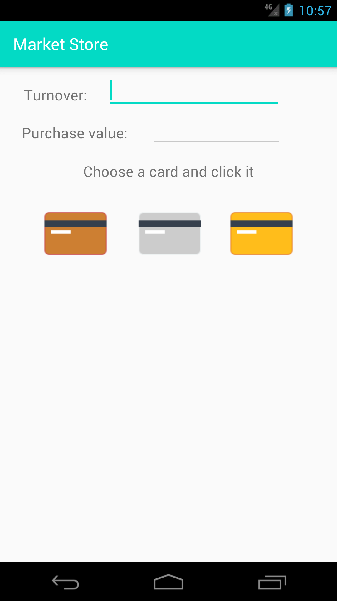

**When the application is running, there is no need to fill the empty fields, it is enough to click a card to see the example output. If you wish, you can enter values to the gaps to test the app.**

###### Example output
>Bronze Card

>Silver Card

>Gold Card

